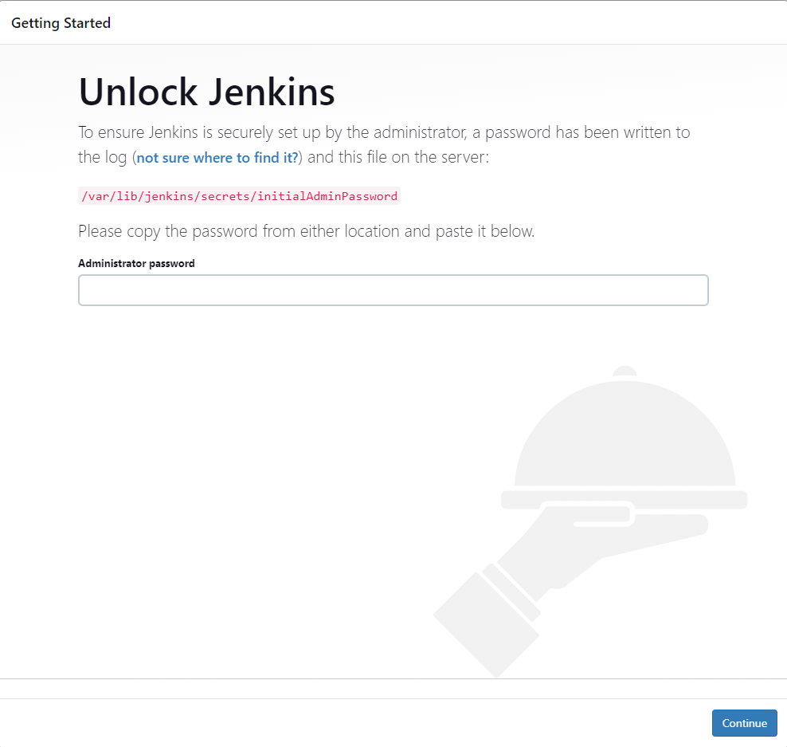
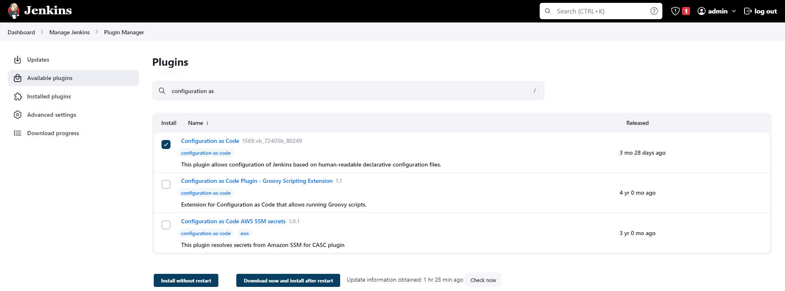
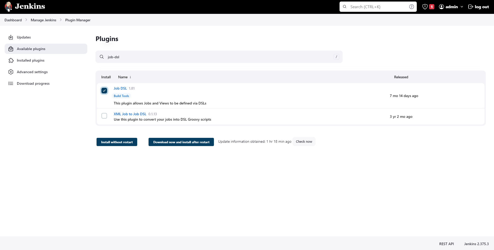
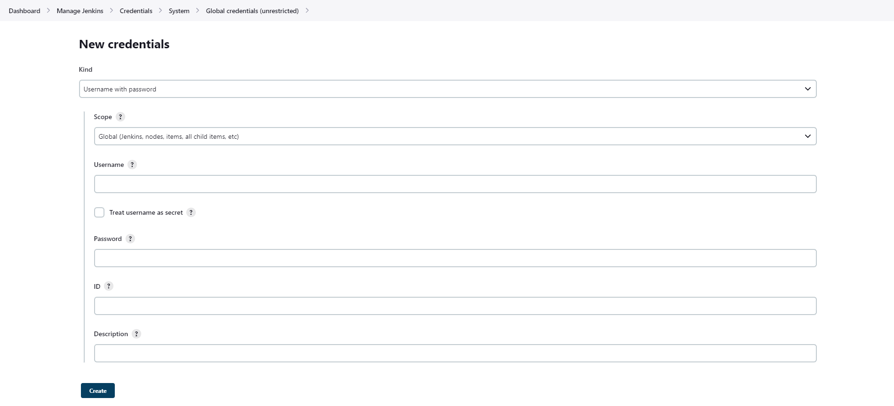
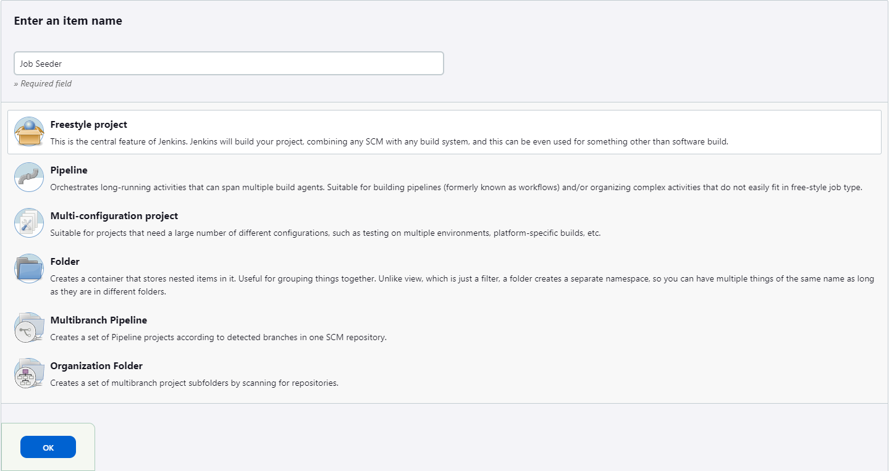
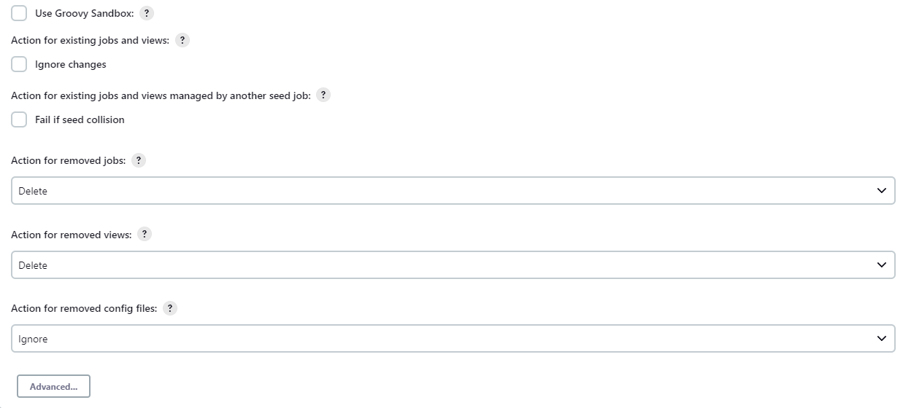
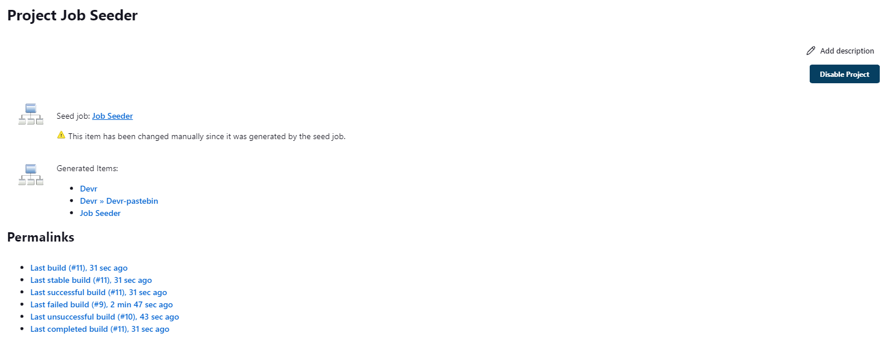
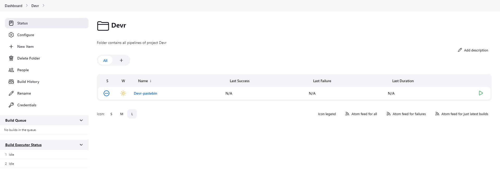
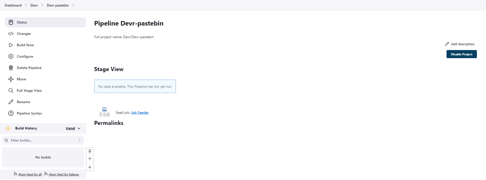

<h1>Jenkins & Job DSL</h1>

After finish running Ansible to install Jenkins, let's head to the browser at `https://localhost:8080` to login to Jenkins. Follow the instruction to finish the installation and login:


Go to the `Dashboard > Manage Jenkins > Plugin Manager` page, select `Available plugins`, search for `configuration-as-code` and `job-dsl`. The result will be like this:


Select `Install without restart`

Next, we will setup some credentials for Github and Docker registry. Go to `Dashboard > Manage Jenkins > Credentials`, click to domain `(global)` then `Add Credentials`. We will create 2 credentials here. First one is the token on Github. We will create it with kind `Secret text` and input the token into. After that, we will create another one with kind `Username with password` for Docker registry.



Usually, I will use `Puppet` as my configuration management tool to control all of the YAML files in `casc_configs` folder, which will be used by `Configuration as Code` plugin. The `Job Seeder` job will also be created from CasC. However, due to the limitation of time for this assignment, I will create the `Job Seeder` job manually. But you can still have a look at my `job-seeder.yaml` file like a reference.

Go back to the dashboard, click the `New Item` link on the left of the dashboard. On the screen that follows, type in `Job Seeder`, select Freestyle project, and click OK.


In the screen that follows, scroll down to the `Build Steps` section and click on the `Add build step` dropdown. Next select `Process Job DSLs`.

Then, click on the radio button next to `Use the provided DSL script`, and paste the below code snippet (remember to change the Github URL):
```groovy
job('Job Seeder') {
  scm {
    git {
      remote {
        url('https://github.com/thongngo3301/devr')
        // Got my repository public so I didn't declare the credentials here
      }
      branch('master')
    }
  }
  steps {
    dsl {
      external('job-dsl/pipelines/*.groovy')
      removeAction('DELETE')
      removeViewAction('DELETE')
    }
  }
  triggers {
    scm('H/15 * * * *')
  }
}
```
Other options should be like this:


Click `Save` to create the job. This will take you to the `Job Seeder` job page.

Now we will prepare the Jenkins pipeline for Pastebin by using Job DSL. My code for the pipeline is written in `groovy` at [HERE](pipelines/devr.groovy).

Push the `groovy` file to Github, then go back to our Jenkins `Job Seeder`. Click `Build now` to force Jenkins generate our pipeline immediately.

If `Build now` failed, go to the `Dashboard > Manage Jenkins > ScriptApproval` page then `Approve` for Groovy scripts. After that, try to `Build now` again.

Our result should look like this:




Jenkins pipeline is settled now, we will move on to the logic of the Jenkinsfile, which is documented at [HERE](../pastebin-cicd/README.md).