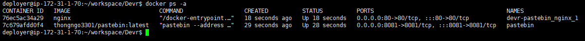

<h1>CI/CD Pipeline</h1>

In order to have a pipeline run, we need to create a Jenkins slave for it. In our case, Jenkins slave is also the Jenkins master. But we will still create as a separated node instead of using the Built-in node. Because we want the root directory will be `deployer`, not `jenkins`.

On Jenkins master, switch to user `jenkins` then generate the SSH public key and save the content of file `/var/lib/jenkins/.ssh/id_rsa` as a credential on dashboard.
```
ssh-keygen
```

Next, copy content of file `/var/lib/jenkins/.ssh/id_rsa.pub` to `/home/deployer/.ssh/authorized_keys` (create if not exists)

Create Jenkins slave named `devr`:


In [Jenkinsfile](https://github.com/thongngo3301/pastebin/blob/master/Jenkinsfile), we will specify the agent node to execute our pipeline:
```groovy
agent {
  node {
    label 'devr'
  }
}
```

Our [Jenkinsfile](https://github.com/thongngo3301/pastebin/blob/master/Jenkinsfile) will have several stages like this:

- <b>Build</b>: Using `docker build` to build an image for Pastebin app based on its `Dockerfile`.
- <b>Push</b>: Pushing built image to [registry](https://registry.hub.docker.com) with predefined credentials.
- <b>Deploy</b>: Using `docker-compose` with new image getting from registry, we will (re)create containers on the destination server.
- <b>Test</b>: Using a Python script to execute an automation test case with Chrome web driver to check whether the application was accessible from a web browser.

With all of the setup until now, we can have the pipeline automatically trigger whenever there is a change on `master` branch. The pipeline will run through those stages step-by-step.

I also modified Dockerfile to only copy necessary files and folders in order to have static layers, prevent running `cargo install` everytime even when we only edit `Jenkinsfile`.
```docker
# Only copy necessary folder
COPY ./Cargo.toml ./Cargo.toml
COPY ./api.fbs ./api.fbs
COPY ./static ./static
COPY ./src ./src

RUN cargo install --path .
```

Furthermore, I deleted redundant `volumes` declaration in `docker-compose.yml`:


The result of our pipeline should look like this:




Log for this run: [HERE](logs/success.log)